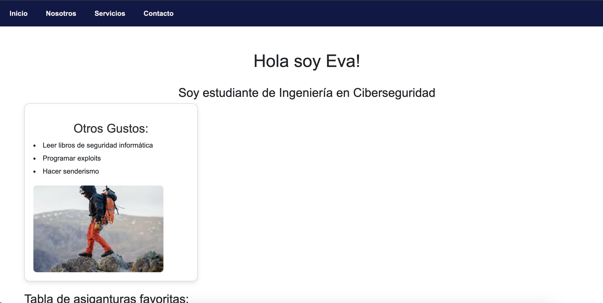
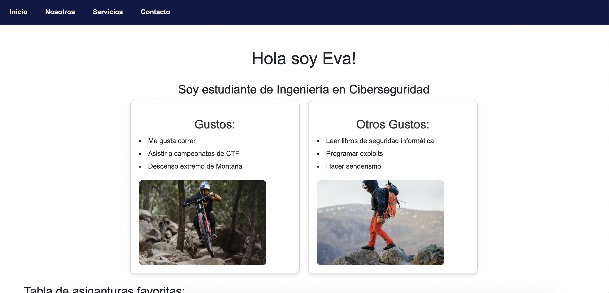

## Crear cv 

#### Se estructura el sitio con la nomesclatura de:
- carpeta CV/
  - index.html
  - img/ imagenes
  - css/style.css

Se actualiza la primera parte del sitio, fue creado:
- Navbar
- Footer
- Imágenes 

Se agrega la segunda card para definición de gustos:

